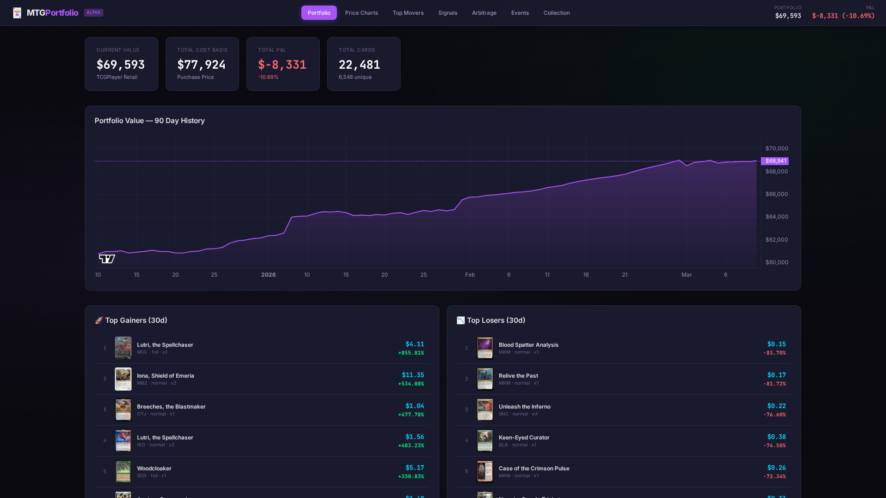
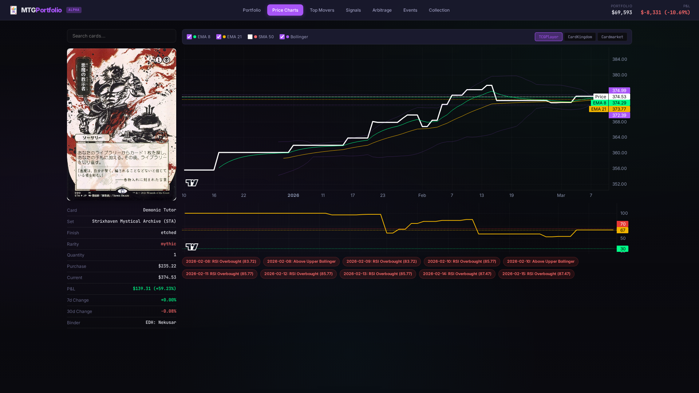
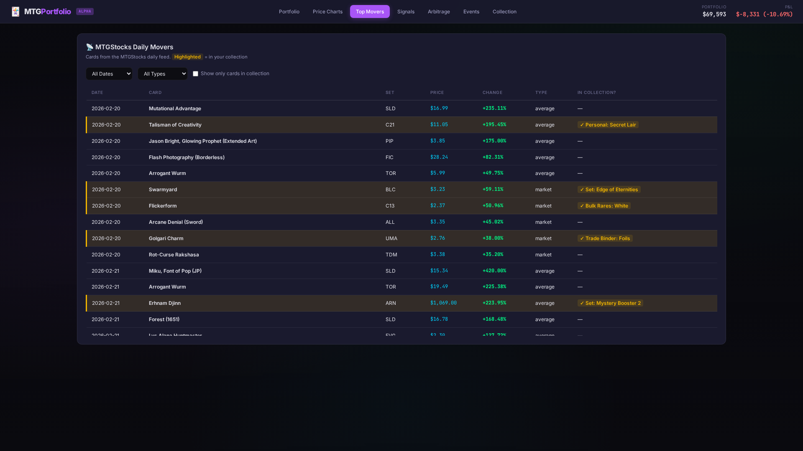
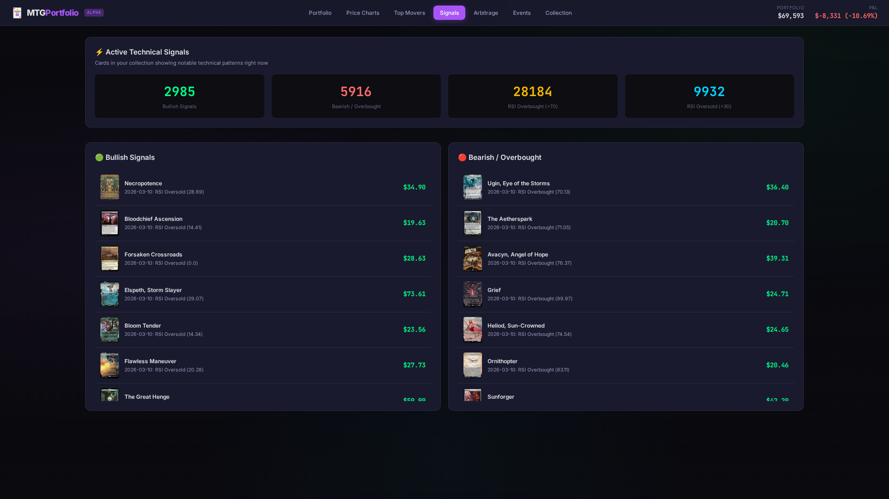
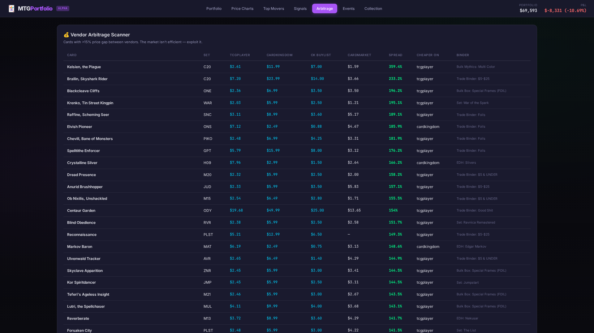
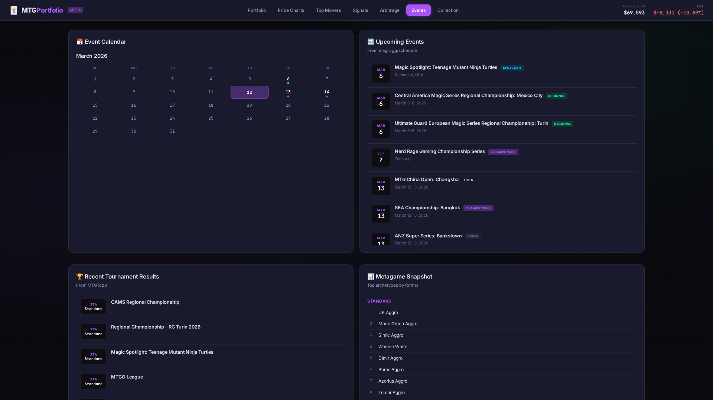
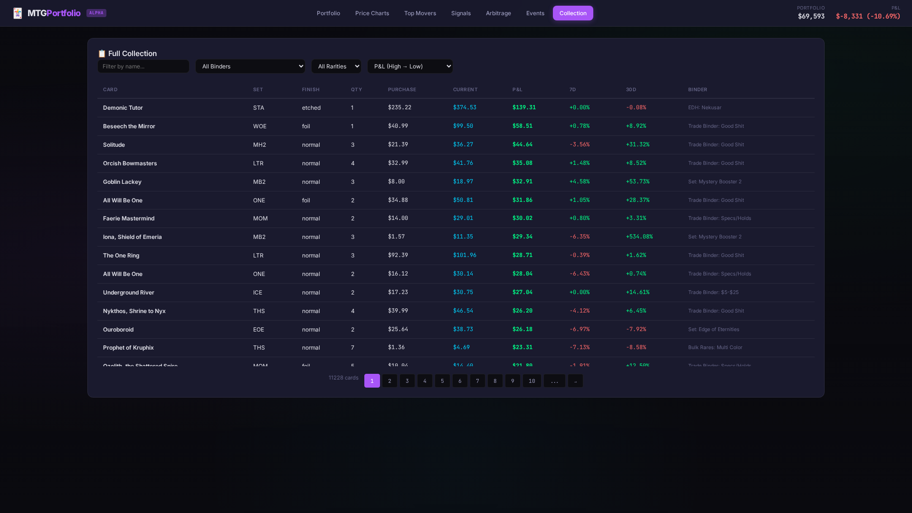

# 🃏 Mana Vault

Track your Magic: The Gathering collection like a stock portfolio — with price charts, technical analysis, daily movers, arbitrage detection, and tournament data.



## Features

### 📈 Portfolio Overview
KPI dashboard with total collection value, cost basis, P&L, and a 90-day portfolio value chart. Top gainers and losers by 30-day performance, plus breakdowns by binder and rarity.

### 📊 Price Charts with Technical Analysis
Interactive per-card price charts powered by [Lightweight Charts](https://github.com/nicehash/lightweight-charts). Includes EMA 8/21, SMA 50, Bollinger Bands, RSI, and signal detection (crossovers, overbought/oversold, BB breakouts). Switch between TCGPlayer, CardKingdom, and Cardmarket pricing.



### 📡 Daily Movers (MTGStocks)
Ingests daily movers from MTGStocks and cross-references with your collection. Filter by date, price type, or collection-only. Click any card in your collection to jump straight to its price chart.



### ⚡ Technical Signals
Surfaces cards in your collection with notable technical patterns — bullish EMA crossovers, RSI oversold conditions, Bollinger Band breakouts. Scan for buying or selling opportunities at a glance.



### 💰 Vendor Arbitrage Scanner
Finds cross-vendor price gaps >15% between TCGPlayer, CardKingdom, and Cardmarket. Exploit market inefficiencies with direct links to each vendor's buy page.



### 📅 Events Calendar
Scrapes upcoming events from [magic.gg](https://magic.gg/schedule) and recent tournament results from [MTGTop8](https://mtgtop8.com). Calendar view with event dots, upcoming event cards with type badges, and a metagame snapshot showing top archetypes by format.



### 📋 Full Collection Browser
Searchable, sortable, paginated table of every card in your collection with current prices, P&L, and period changes. Filter by binder, rarity, or name.



## Data Pipeline

```
ManaBox CSV → preprocess.py → dashboard/public/data/*.json
AllPrices.json (MTGJSON 1.2GB) ─┘
```

**`preprocess.py`** — Single-pass streaming extraction of price history from MTGJSON's AllPrices.json. Computes technical indicators (EMA, SMA, RSI, Bollinger Bands), detects signals, calculates P&L, and identifies arbitrage opportunities.

**`update.py`** — Downloads fresh MTGJSON data and re-runs the preprocessor. `python3 update.py` for daily prices, `--full` for full 90-day history rebuild.

**`scrape_events.py`** — Playwright-based scraper for magic.gg schedule and MTGTop8 tournament results/metagame data.

## Tech Stack

- **Frontend**: Vanilla JS + [Vite](https://vitejs.dev) + [Lightweight Charts](https://github.com/nicehash/lightweight-charts) (TradingView)
- **Styling**: Custom CSS dark theme with glassmorphism and HUD aesthetics
- **Data**: [MTGJSON](https://mtgjson.com) price data + [Scryfall](https://scryfall.com) card images
- **Collection**: [ManaBox](https://manabox.app) CSV export
- **Scraping**: [Playwright](https://playwright.dev) for tournament data
- **External Data**: [MTGStocks](https://mtgstocks.com) daily movers

## Quick Start

```bash
# Install dependencies
cd dashboard && npm install

# Export your collection from ManaBox as CSV
# Place ManaBox_Collection.csv in the project root

# Download MTGJSON price data
python3 update.py --full

# Run the preprocessor
python3 preprocess.py

# Start the dev server
cd dashboard && npm run dev
```

## Hyperlinks

Every card name, price, and event links to external resources:

| Element | Links To |
|---|---|
| Card names | [Scryfall](https://scryfall.com) |
| Prices | [TCGPlayer](https://tcgplayer.com) / [CardKingdom](https://cardkingdom.com) |
| Movers | [MTGStocks](https://mtgstocks.com) |
| Events | [magic.gg](https://magic.gg) / [MTGTop8](https://mtgtop8.com) |

## License

MIT
